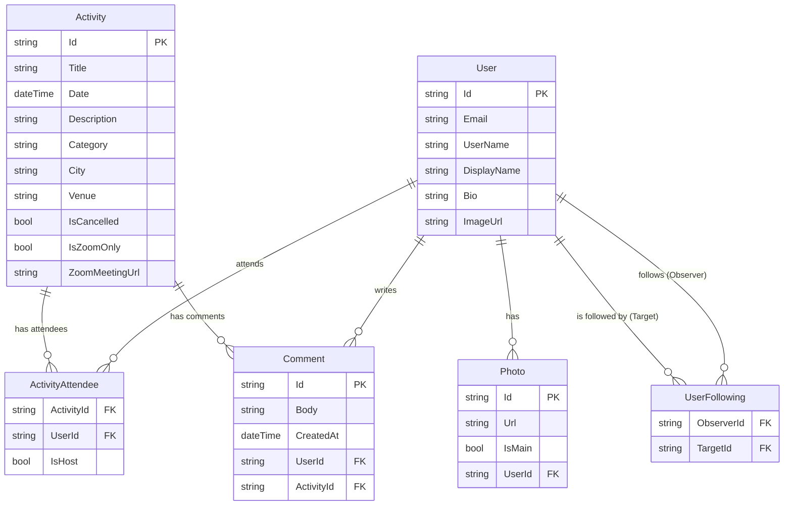

# Database Schema Presentation

To obtain a visual representation of your database for your Viva presentation, you can use the following Entity Relationship Diagram (ERD). 

### 1. Database Overview
- **Database Engine**: functional SQLite (Development), PostgreSQL/SQLServer (Production ready)
- **ORM**: Entity Framework Core
- **Key Features**: Identity Management, Many-to-Many Relationships (Attendees), Self-Referencing Relationships (Followers).

### 2. Entity Relationship Diagram (Mermaid)

You can view this diagram directly in VS Code if you have a Markdown previewer, or copy the code below into [Mermaid Live Editor](https://mermaid.live).

### 3. How to Show Live Data

**Option A: Swagger UI (API Documentation)**
1. Run your backend API (`dotnet watch --no-hot-reload` or `dotnet run`).
2. Open your browser to `https://localhost:5000/swagger`.
3. This shows all your API endpoints and schemas, which proves your database logic is working. You can "Try it out" to see JSON responses containing data.

**Option B: SQLite Viewer (VS Code Extension)**
1. Install the **"SQLite Viewer"** extension in VS Code.
2. In the file explorer, right-click `API/reactivities.db`.
3. Select "Open with SQLite Viewer".
4. This will let you browse the raw tables and rows directly in VS Code during your presentation.

**Option C: DB Browser for SQLite (Standalone App)**
1. If allowed, download [DB Browser for SQLite](https://sqlitebrowser.org/).
2. Open `API/reactivities.db` with it.
3. This provides a full desktop interface to browse data.
